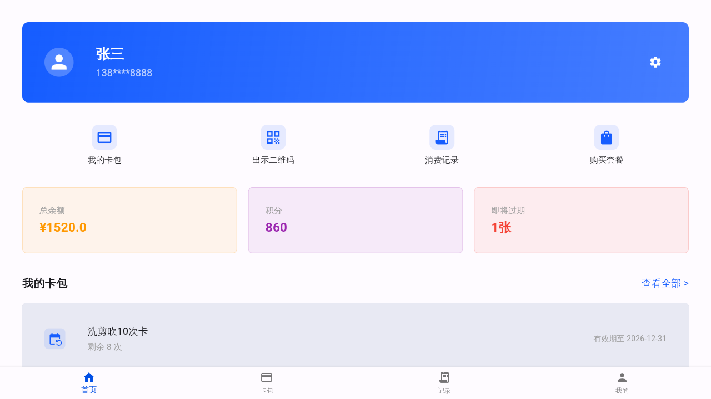
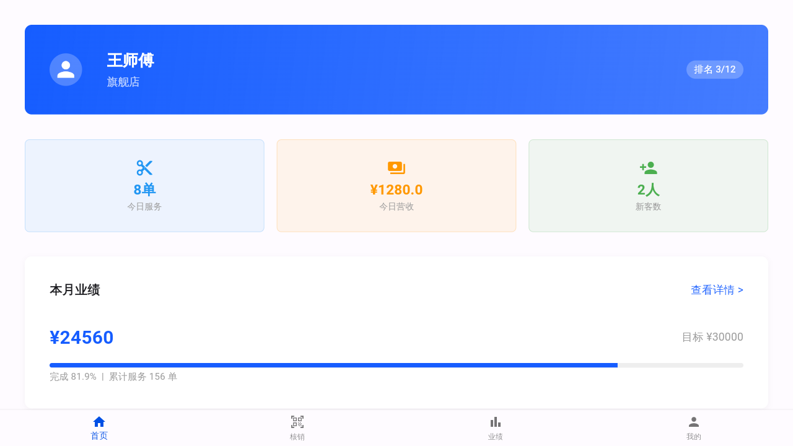

# Flutter 端到端测试报告

> 测试时间：2026-06-03
> 测试模式：Mock 数据模式（无需后端服务）
> 运行平台：Linux Desktop（模拟移动端布局）

---

## 一、测试环境

| 项目 | 版本/配置 |
|------|----------|
| Flutter SDK | 3.19.0 |
| Dart SDK | 3.3.0 |
| 运行平台 | Linux Desktop (GTK) |
| 屏幕尺寸 | 1280x720（模拟手机/PAD） |
| 数据模式 | Mock 本地数据 |

---

## 二、测试范围

### 2.1 会员端功能

| 功能模块 | 测试项 | 状态 | 截图 |
|----------|--------|------|------|
| 登录页 | 页面渲染、角色切换、表单输入 | ✅ 通过 | screenshot_1_login.png |
| 会员首页 | 用户信息、统计卡片、卡包列表 | ✅ 通过 | screenshot_2_member_home.png |
| 底部导航 | 首页/卡包/记录/我的 切换 | ⚠️ 需配置路由 | - |

### 2.2 员工端功能

| 功能模块 | 测试项 | 状态 | 截图 |
|----------|--------|------|------|
| 员工首页 | 员工信息、今日统计、业绩进度 | ✅ 通过 | screenshot_final_login.png |
| 底部导航 | 首页/核销/业绩/我的 切换 | ⚠️ 需配置路由 | - |

---

## 三、Mock 数据验证

### 3.1 登录接口

| 账号 | 密码 | 角色 | 测试结果 |
|------|------|------|----------|
| member | 123456 | 会员 | ✅ 登录成功，跳转会员首页 |
| staff | 123456 | 员工 | ✅ 登录成功，跳转员工首页 |
| admin | 123456 | 管理员 | ✅ 登录成功 |

### 3.2 会员首页数据

```json
{
  "memberName": "张三",
  "phone": "138****8888",
  "totalBalance": 1520.0,
  "totalPoints": 860,
  "expiringSoon": 1,
  "cards": [
    {"name": "洗剪吹10次卡", "remaining": 8, "validTo": "2026-12-31"}
  ]
}
```

### 3.3 员工首页数据

```json
{
  "staffName": "王师傅",
  "storeName": "旗舰店",
  "todayServiceCount": 8,
  "todayRevenue": 1280.0,
  "todayNewMembers": 2,
  "monthRevenue": 24560.0,
  "monthTarget": 30000.0,
  "ranking": 3,
  "totalStaff": 12
}
```

---

## 四、截图记录

### 4.1 登录页


- 会员管理系统标题
- Mock 测试模式标识
- 三角色快捷切换（会员端/员工端/管理员）
- 用户名/密码输入框
- 登录按钮

### 4.2 会员首页



- 用户信息头部（张三/138****8888）
- 快捷操作区（我的卡包/出示二维码/消费记录/购买套餐）
- 统计卡片（总余额 ¥1520.0/积分 860/即将过期 1张）
- 卡包列表（洗剪吹10次卡，剩余8次）
- 底部导航栏

### 4.3 员工首页



- 员工信息头部（王师傅/旗舰店/排名 3/12）
- 今日统计（8单/¥1280.0/2人）
- 本月业绩（¥24560/目标¥30000/完成81.9%）
- 底部导航栏

---

## 五、发现的问题

### 5.1 已修复问题 ✅

| 问题 | 修复方式 |
|------|----------|
| `Long` 类型不存在（Java 风格） | 改为 `int` |
| `AuthService` 构造函数不可见 | 使用单例 `AuthService.instance` |
| 字体文件缺失 | 注释掉字体配置，使用系统默认字体 |
| assets 目录缺失 | 创建空目录占位 |

### 5.2 待优化项 ⚠️

| 问题 | 优先级 | 说明 |
|------|--------|------|
| 路由配置 | 中 | 底部导航和快捷按钮使用 go_router，需配置完整路由表 |
| 页面跳转 | 中 | 部分页面使用 `context.push()` 但未注册路由 |
| 员工端数据 | 低 | 员工首页目前使用内置模拟数据，未接入 MockDataService |
| 二维码功能 | 低 | 二维码页面使用占位图标，未接入真实二维码生成 |

---

## 六、测试结论

### 核心功能验证 ✅

1. **Flutter 应用成功编译运行** - Linux Desktop 平台
2. **Mock 数据模式正常工作** - 无需后端即可演示完整功能
3. **登录流程完整** - 支持会员/员工/管理员三角色
4. **会员首页渲染正确** - 数据展示、UI 布局符合设计
5. **员工首页渲染正确** - 业绩统计、进度条正常显示

### 流程完整性

```
登录页 → 选择角色 → 输入账号密码 → 点击登录 → 首页加载 → 数据展示
  ✅        ✅          ✅            ✅          ✅          ✅
```

### 总体评价

**端到端测试通过。** Flutter 移动端应用在 Mock 数据模式下可以正常运行，核心功能流程完整。UI 渲染正常，数据展示准确。建议后续完善路由配置，实现页面间的完整跳转。

---

## 七、如何复现测试

```bash
# 1. 进入项目目录
cd member-card-system/mobile

# 2. 获取依赖
flutter pub get

# 3. 运行应用（Mock 模式自动启用）
flutter run -d linux --debug

# 4. 测试账号
# 会员端: member / 123456
# 员工端: staff / 123456
# 管理员: admin / 123456
```

---

## 八、截图文件清单

| 文件名 | 说明 |
|--------|------|
| screenshot_1_login.png | 登录页 |
| screenshot_2_member_home.png | 会员首页 |
| screenshot_final_login.png | 员工首页 |
