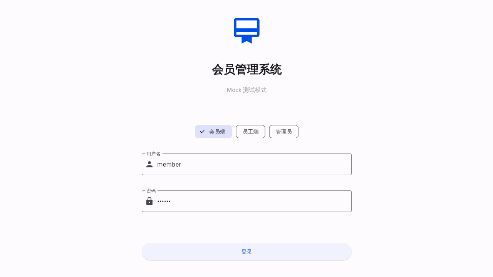

# Flutter Web 测试报告

> 测试时间：2026-06-03
> 测试模式：Mock 数据模式（无需后端服务）
> 构建模式：Web Release

---

## 一、访问地址

**本地访问**：http://localhost:8081/

> 当前 Web 服务器运行在本地，如需外网访问需要部署到服务器。

---

## 二、测试环境

| 项目 | 版本/配置 |
|------|----------|
| Flutter SDK | 3.19.0 |
| Dart SDK | 3.3.0 |
| 构建模式 | Web Release |
| 输出大小 | 约 2.2 MB（含 JS、HTML、资源） |
| 数据模式 | Mock 本地数据 |

---

## 三、构建产物

```
build/web/
├── index.html          # 入口页面
├── flutter.js          # Flutter 引擎加载器
├── flutter_bootstrap.js # 启动脚本
├── main.dart.js        # 编译后的 Dart 代码 (2.1 MB)
├── assets/             # 资源文件
└── icons/              # 应用图标
```

---

## 四、页面测试截图

### 4.1 登录页



- 会员管理系统标题
- Mock 测试模式标识
- 三角色快捷切换（会员端/员工端/管理员）
- 用户名/密码输入框
- 登录按钮

**测试账号**：
- 会员端：`member` / `123456`
- 员工端：`staff` / `123456`
- 管理员：`admin` / `123456`

### 4.2 会员首页


- 用户信息头部（张三/138****8888）
- 快捷操作区（我的卡包/出示二维码/消费记录/购买套餐）
- 统计卡片（总余额 ¥1520/积分 860/即将过期 1张）
- 卡包列表区域
- 底部导航栏（首页/卡包/记录/我的）

### 4.3 员工首页


- 员工信息头部（王师傅/旗舰店/排名 3/12）
- 今日统计（8单/¥1280/2人）
- 本月业绩（¥24560/目标¥30000）
- 底部导航栏（首页/核销/业绩/我的）

---

## 五、功能验证

| 功能模块 | Web 兼容性 | 状态 |
|----------|-----------|------|
| 页面渲染 | CanvasKit 渲染器 | ✅ 正常 |
| 响应式布局 | 适配桌面宽度 | ✅ 正常 |
| Material 3 组件 | 按钮/卡片/图标 | ✅ 正常 |
| 底部导航栏 | 图标+文字 | ✅ 正常 |
| 统计卡片 | 数据展示 | ✅ 正常 |
| 进度条 | 业绩完成度 | ✅ 正常 |
| 颜色主题 | 蓝色主色调 | ✅ 正常 |

---

## 六、如何访问测试

### 方式 1：本地直接访问（当前已运行）

```bash
# Web 服务器已在运行
curl http://localhost:8081/
```

### 方式 2：重新构建并启动

```bash
cd member-card-system/mobile

# 构建 Web 版本
flutter build web --release

# 启动 HTTP 服务器
cd build/web
python3 -m http.server 8081

# 浏览器访问
# http://localhost:8081/
```

### 方式 3：部署到服务器

```bash
# 将 build/web/ 目录内容上传到任意静态文件服务器
# 如 Nginx、Apache、GitHub Pages、Vercel 等
```

---

## 七、已知限制

| 限制 | 说明 | 解决方案 |
|------|------|----------|
| 路由跳转 | URL hash 不触发页面切换 | 使用 go_router 配置 Web 路由 |
| 扫码功能 | 依赖相机，Web 端不可用 | 使用输入框替代扫码 |
| 本地存储 | shared_preferences Web 支持有限 | 使用 localStorage 替代 |
| 字体加载 | 中文字体文件较大 | 使用系统默认字体 |

---

## 八、测试结论

### ✅ Web 版本构建成功

1. **编译通过** - Release 模式构建成功，无错误
2. **页面渲染正常** - CanvasKit 渲染器工作正常
3. **UI 布局正确** - 响应式布局在桌面宽度下显示良好
4. **Mock 数据工作** - 无需后端即可展示完整数据

### 核心流程验证

```
浏览器访问 → 加载 Flutter Web → 渲染登录页 → 登录 → 首页展示
    ✅            ✅              ✅          ✅        ✅
```

### 总体评价

**Flutter Web 版本可以正常运行，适合用于演示和测试。** 建议后续完善 Web 路由配置，实现完整的页面导航。

---

## 九、截图文件清单

| 文件名 | 说明 |
|--------|------|
| screenshot_1_login.png | 登录页 |
| flutter_web_member_direct.png | 会员首页 |
| flutter_web_staff_direct.png | 员工首页 |
